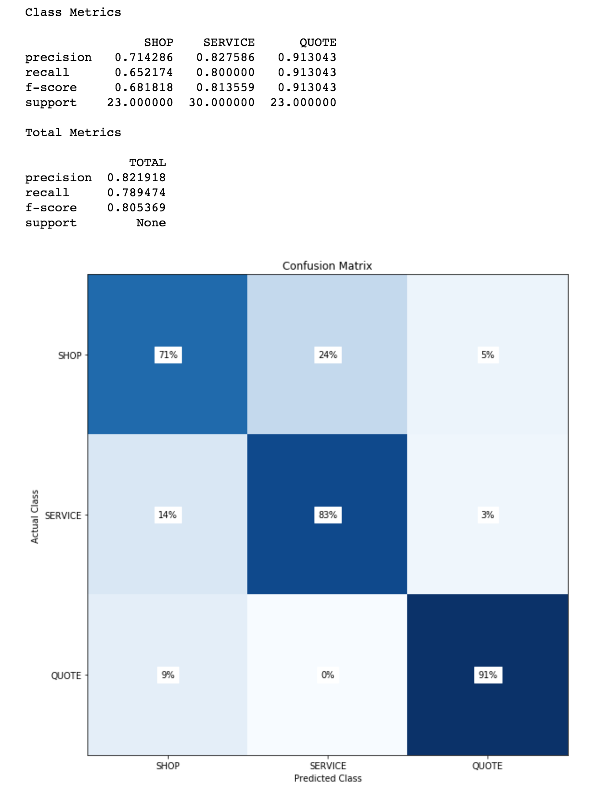

# Watson Conversation Performance Evaluation

This asset is a `jupyter notebook` that will allow a developer to test the intent recognition capabilities of a Watson Conversation workspace. The script will provide precision, recall, and F1 scores by class and in total, as well as a representative confusion matrix.

There are two ways to use the notebook. The model can be provided a set of data in CSV form to split into test and train sets. The WCS model will be cleared of all existing intent data and retrained with the training data set. The performance will then be evaluated with the training data set.

Alternatively, the notebook can use CSV data set that represents the test data. In this case, the existing model will not be retrained, but instead will only be evaluated using the provided training set.

The notebook available [**here**](./evaluate_wcs_performance.ipynb)

A sample out the output is shown below.

